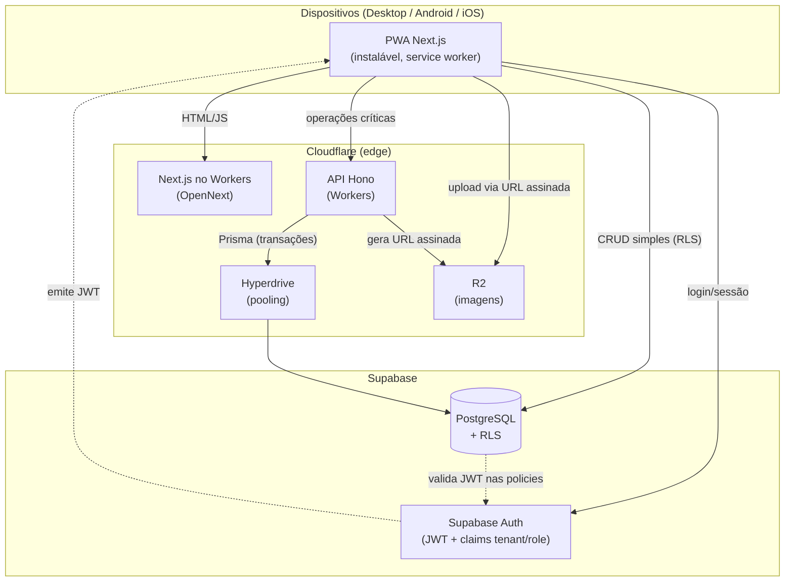

# NexoLoja — Documento de Arquitetura

> Documento de referência técnica do projeto. A decisão de stack está formalizada em [ADR-005](./adr/ADR-005-stack-e-arquitetura.md). Decisões pontuais de modelagem estão nos demais ADRs em [`docs/adr/`](./adr/).
>
> **Status:** Proposto para aprovação · **Última atualização:** 2026-06-21

---

## 1. Objetivo e princípios

NexoLoja é um ERP/PDV **multi-tenant, modular e custo-zero** para pequenas e médias empresas, com módulo específico de **Material de Construção**. Acessível por **navegador, Android e iOS** a partir de uma **única base de código (PWA)**.

Princípios que guiam toda decisão:

1. **Uma base, três plataformas** — PWA instalável; sem apps nativos nesta fase.
2. **Custo-zero no início** — planos gratuitos de Supabase e Cloudflare.
3. **Multi-tenancy estrito** — isolamento garantido no banco via Row-Level Security (RLS), não apenas na aplicação.
4. **Usabilidade acima de tudo** — menos cliques, leitor de código de barras, atalhos de teclado no desktop.
5. **Lógica de negócio pura e testável** — cálculos de caixa, estoque e frete isolados em funções puras compartilhadas.
6. **Edge-first** — execução próxima do usuário (Cloudflare Workers), rápida e escalável.

---

## 2. Stack tecnológica

| Camada | Tecnologia | Por quê |
|--------|-----------|---------|
| **App / Frontend** | Next.js (App Router) + TypeScript + React | SSR/edge, ecossistema maduro, vira PWA |
| **PWA / Offline shell** | Serwist (service worker) + Web App Manifest | Instalável; sucessor mantido do `next-pwa` |
| **UI** | Tailwind CSS + shadcn/ui (Radix) | Acessível, rápido de montar, consistente |
| **Estado / dados (cliente)** | TanStack Query + Zustand | Cache de servidor + estado de UI local |
| **Backend / API** | Hono sobre Cloudflare Workers | Minúsculo, ótimo no edge, "API unificada" |
| **ORM / schema** | Prisma (fonte única de schema e migrações) | Type-safety, migrações versionadas |
| **Acesso a dados (trivial)** | `supabase-js` com RLS | Menos código, real-time, isolamento no banco |
| **Banco** | Supabase PostgreSQL | Postgres gerenciado gratuito |
| **Pooling** | Cloudflare Hyperdrive → Supavisor | Conexões eficientes a partir de Workers |
| **Autenticação** | Supabase Auth + RLS | Seguro, gratuito, isolamento por tenant |
| **Mídia** | Cloudflare R2 (URLs assinadas) | 10 GB grátis; nunca BLOB no banco |
| **Código de barras** | `BarcodeDetector` API + fallback `@zxing/library` | Nativo no navegador quando disponível |
| **Testes** | Vitest (unit) + Playwright (e2e) | Cobre cálculos críticos e fluxos ponta-a-ponta |
| **Monorepo** | Turborepo + npm workspaces | Build incremental, código compartilhado |
| **CI/CD** | GitHub Actions + Wrangler | Deploy de Workers e migrações automatizados |

---

## 3. Diagrama de containers (C4 nível 2)



**Leitura do diagrama:** o cliente fala direto com o banco (via `supabase-js`) para o que é trivial — protegido por RLS — e só recorre à API Hono quando há transação, segredo ou regra de negócio que precisa rodar no servidor (fechamento de caixa, movimentação de estoque, confirmação de pedido, auditoria, geração de URL assinada do R2).

---

## 4. Estrutura do monorepo

```
nexoloja/
├── apps/
│   ├── web/                  # PWA Next.js (App Router)
│   │   ├── app/              # rotas e páginas
│   │   ├── components/       # componentes de UI
│   │   ├── lib/              # supabase client, query client, helpers
│   │   └── public/           # manifest.json, ícones, service worker
│   └── api/                  # API Hono (Cloudflare Workers)
│       ├── src/routes/       # endpoints (orders, cash, stock, uploads…)
│       ├── src/middleware/   # auth (verifica JWT), tenant, erros
│       └── wrangler.toml
├── packages/
│   ├── db/                   # Prisma: schema, client, migrações, seed
│   │   └── prisma/schema.prisma
│   ├── core/                 # lógica de negócio PURA (sem I/O)
│   │   ├── cash/             # fechamento de caixa
│   │   ├── stock/            # movimentação e saldo (ver ADR-001)
│   │   ├── freight/          # cálculo de frete pesado
│   │   └── units/            # conversão de unidades (milheiro, saco…)
│   ├── shared/               # tipos + schemas Zod compartilhados
│   └── config/               # tsconfig, eslint, tailwind preset
├── docs/
│   ├── ARCHITECTURE.md
│   └── adr/
├── turbo.json
└── package.json              # workspaces
```

**Regra de ouro:** `packages/core` não importa nada de I/O (banco, rede). São funções puras `(entrada) => saída`, testadas exaustivamente com Vitest e reusadas tanto no cliente (cálculo otimista) quanto no servidor (cálculo autoritativo). Isso atende diretamente à exigência do `CLAUDE.md` de testes para caixa, estoque e fluxo de caixa.

---

## 5. Segurança e multi-tenancy

O isolamento entre lojas é garantido **no banco**, não só na aplicação — a defesa mais forte possível.

- **Identidade:** Supabase Auth emite um JWT por usuário. Um *auth hook* injeta `tenant_id` e `role` nas claims (a partir de uma tabela de perfil que liga `user → tenant`).
- **RLS:** toda tabela com `tenantId` tem policies do tipo:

  ```sql
  CREATE POLICY tenant_isolation ON products
    USING (tenant_id = (auth.jwt() ->> 'tenant_id')::uuid);
  ```

  Assim, mesmo que o cliente fale direto com o Postgres via `supabase-js`, é impossível ler/escrever dados de outro tenant.
- **API Hono:** valida o JWT em middleware, extrai `tenant_id`/`role` e injeta o contexto em toda operação Prisma; nunca confia em `tenantId` vindo do corpo da requisição.
- **Papéis:** `OWNER`, `MANAGER`, `CASHIER`, `STOCK` controlam autorização fina (ex: só OWNER/MANAGER fecham caixa com divergência).
- **Segredos:** chaves de service-role e do R2 ficam só nos Workers (variáveis de ambiente do Wrangler), nunca no cliente.
- **Sessão:** cookies HttpOnly gerenciados pelo helper SSR do Supabase.

---

## 6. Estratégia offline (faseada)

| Fase | Capacidade offline |
|------|--------------------|
| **MVP (online-first)** | PWA instalável; cache de assets e de leituras (catálogo, clientes) via service worker + TanStack Query. Escrita exige conexão. |
| **Fase 2 (offline-first)** | Caixa opera sem internet: vendas gravadas em **IndexedDB** (Dexie), com **fila de sincronização**. Ao reconectar, a fila envia ao servidor. |
| **Resolução de conflitos** | O campo `syncStatus` (`PENDING`/`SYNCED`/`CONFLICT`) já existe no schema. IDs UUID gerados no cliente evitam colisão. Conflitos de estoque resolvidos pela reconciliação descrita no [ADR-001](./adr/ADR-001-consistencia-de-estoque.md). |

O schema **já nasce preparado** para offline (UUIDs no cliente, `syncStatus`, vendas como `PENDING`), então adiar a implementação não gera retrabalho de modelagem.

---

## 7. Implantação (deploy)

- **Web:** `apps/web` → Cloudflare Workers via **adaptador OpenNext** (`npx opennextjs-cloudflare`).
- **API:** `apps/api` → Cloudflare Workers via **Wrangler**.
- **Banco:** migrações Prisma aplicadas ao Supabase (`prisma migrate deploy`) no pipeline de CI.
- **Pooling:** Hyperdrive configurado apontando para o pooler do Supabase (Supavisor).
- **CI/CD:** GitHub Actions roda lint + testes (`turbo run lint test`), depois aplica migrações e publica os dois Workers.

### Riscos operacionais conhecidos

1. **Free tier do Supabase pausa após ~1 semana de inatividade** e limita 500 MB. Mitigação: *cron* de keep-alive (ping diário) durante o desenvolvimento e **upgrade para o plano Pro (~US$25/mês) no lançamento** em produção — um PDV real não pode depender de um banco que pausa.
2. **Limites diários de Hyperdrive no free tier** — validar contra o volume esperado de queries.

---

## 8. Roadmap por fases

| Fase | Entregáveis |
|------|-------------|
| **0 — Fundação** | Monorepo (Turborepo), config compartilhada, Prisma aplicado ao Supabase, policies RLS, Supabase Auth com claims de tenant, CI verde. |
| **1 — MVP (online-first)** | Onboarding de loja; cadastro de produtos, clientes, fornecedores; PDV (venda + pagamentos); abertura/fechamento de caixa; movimentação de estoque; relatórios básicos; PWA instalável. |
| **2 — Módulo Material de Construção** | Conversão de unidades (milheiro, saco, m²/m³), cálculo de frete pesado, entregas (`Delivery`), leitor de código de barras refinado. |
| **3 — Offline-first** | IndexedDB + fila de sincronização + resolução de conflitos; caixa 100% funcional sem internet. |
| **4 — Fiscal e avançado** | NFC-e/NF-e (via API fiscal terceira), pipeline de imagens no R2, relatórios avançados, auditoria seletiva ([ADR-004](./adr/ADR-004-soft-delete-e-auditoria.md)). |

---

## 9. Decisões em aberto (a registrar como ADRs quando decididas)

- Provedor de emissão fiscal (NFC-e/NF-e) — depende de integração de terceiros.
- Ferramenta de observabilidade compatível com custo-zero (logs fora do Postgres, conforme `CLAUDE.md`).
- Estratégia de impressão (cupom/etiqueta) na PWA — limitação conhecida de PWAs com hardware.
