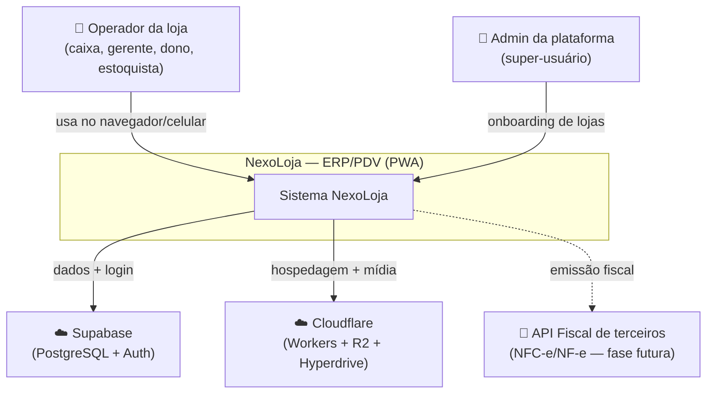
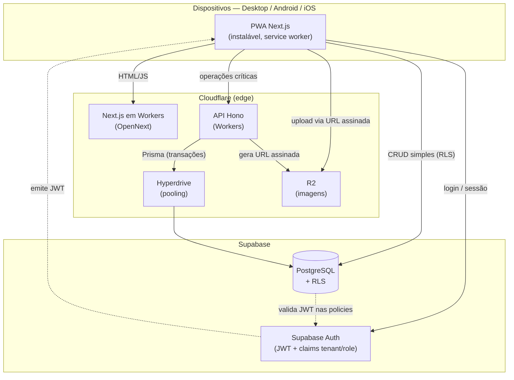
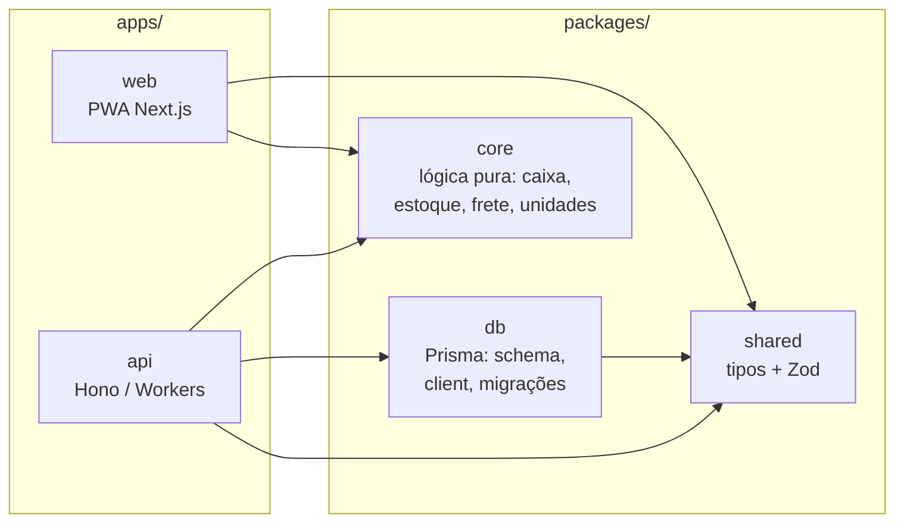
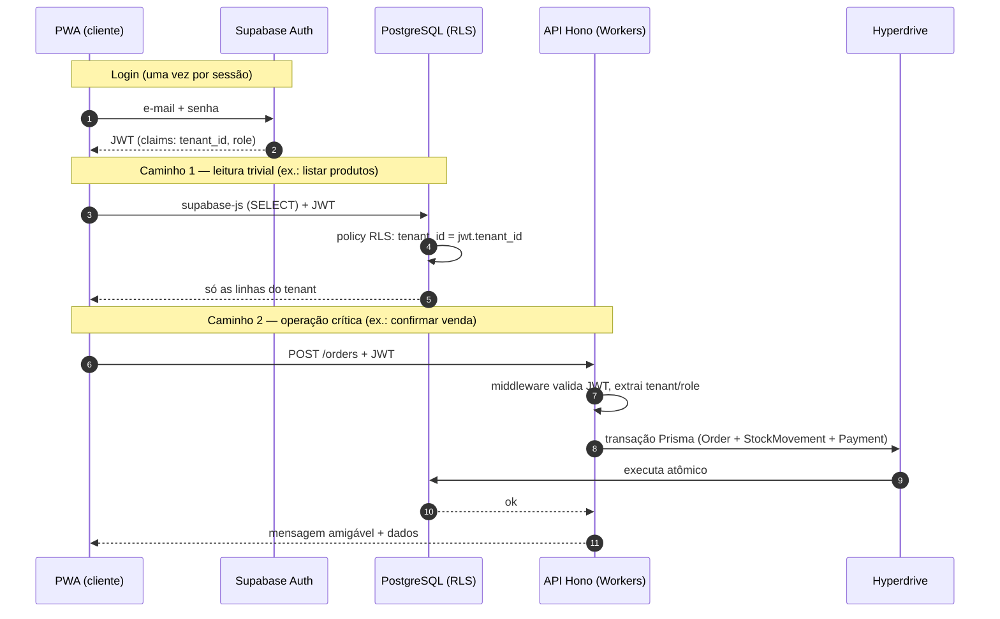
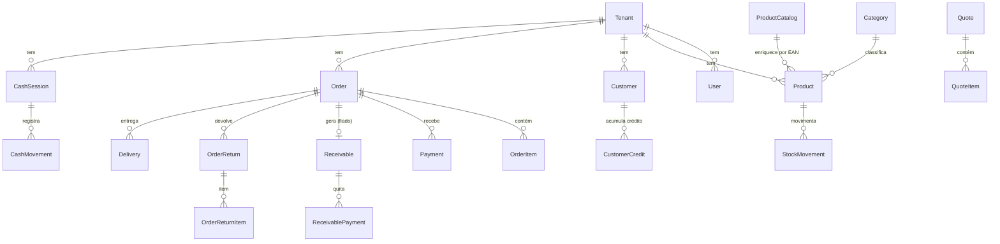

# NexoLoja — Documentação Técnica

> **Documento vivo · consolidado.** Reúne, em um só lugar, a visão técnica completa do projeto:
> tecnologias, linguagens, banco, hospedagem, APIs, segurança, modelo de dados, glossário de siglas
> e diagramas de arquitetura.
>
> **Produto:** ERP/PDV multi-tenant, modular e custo-zero (PWA única para Web/Android/iOS).
> **Última atualização:** 2026-08-16 · **Fontes:** `docs/ARCHITECTURE.md`, `docs/adr/` (ADR-001…025), código do monorepo.

---

## Índice

1. [Visão geral em 30 segundos](#1-visão-geral-em-30-segundos)
2. [Glossário de siglas e termos](#2-glossário-de-siglas-e-termos)
3. [Stack tecnológica completa](#3-stack-tecnológica-completa)
4. [Linguagens e por que cada uma](#4-linguagens-e-por-que-cada-uma)
5. [Arquitetura — diagramas C4](#5-arquitetura--diagramas-c4)
6. [Fluxo de uma requisição (dois caminhos)](#6-fluxo-de-uma-requisição-dois-caminhos)
7. [Estrutura do monorepo](#7-estrutura-do-monorepo)
8. [Backend — API Hono](#8-backend--api-hono)
9. [Frontend — PWA Next.js](#9-frontend--pwa-nextjs)
10. [Banco de dados e modelo](#10-banco-de-dados-e-modelo)
11. [Segurança e multi-tenancy](#11-segurança-e-multi-tenancy)
12. [Hospedagem e deploy](#12-hospedagem-e-deploy)
13. [Estratégia offline](#13-estratégia-offline)
14. [Qualidade, testes e CI/CD](#14-qualidade-testes-e-cicd)
15. [Decisões de arquitetura (ADRs)](#15-decisões-de-arquitetura-adrs)
16. [Ambiente de desenvolvimento](#16-ambiente-de-desenvolvimento)

---

## 1. Visão geral em 30 segundos

NexoLoja é um **ERP/PDV** (gestão + ponto de venda) para pequenas e médias lojas, com foco inicial em
**material de construção**. Roda como **uma única PWA** (Progressive Web App) que se instala no desktop,
Android e iOS a partir do mesmo código. A arquitetura é **edge-first**: o código executa perto do usuário
na rede da Cloudflare, e o banco é um PostgreSQL gerenciado pelo Supabase com isolamento por loja garantido
**no próprio banco** (RLS). Tudo foi desenhado para operar dentro dos **planos gratuitos** (custo-zero) no
início e escalar sem retrabalho.

| Dimensão | Escolha |
|---|---|
| Padrão de app | PWA instalável (uma base → Web + Android + iOS) |
| Frontend | Next.js 15 (App Router) + React 19 + TypeScript |
| Backend | Hono sobre Cloudflare Workers |
| Banco | Supabase PostgreSQL + Row-Level Security |
| ORM | Prisma 6 (fonte única de schema e migrações) |
| Auth | Supabase Auth (JWT com claims `tenant_id` e `role`) |
| Hospedagem | Cloudflare Workers (web + API) via OpenNext e Wrangler |
| Mídia | Cloudflare R2 (só a URL no banco) |
| Monorepo | Turborepo + npm workspaces |

---

## 2. Glossário de siglas e termos

Referência rápida — cada sigla que aparece na documentação e no código.

### Produto / negócio

| Sigla / termo | Significado | O que é no NexoLoja |
|---|---|---|
| **ERP** | *Enterprise Resource Planning* | Sistema de gestão da empresa (estoque, financeiro, clientes, fornecedores). |
| **PDV / POS** | Ponto de Venda / *Point of Sale* | Tela de venda no balcão: carrinho, pagamentos, caixa. |
| **Multi-tenant** | Multi-inquilino | Uma instalação atende várias lojas (*tenants*) isoladas entre si. |
| **Tenant** | Inquilino | Cada loja é um tenant, identificada por `tenant_id` (UUID). |
| **Fiado** | Venda a prazo | Cliente leva agora e paga depois → vira *conta a receber*. |
| **Sangria / Suprimento** | — | Retirada / reforço de dinheiro no caixa (movimentações que não são venda). |
| **Milheiro / Saco / m² / m³** | — | Unidades do ramo de construção (venda por milheiro de tijolo, saco de cimento, metragem). |
| **RBAC** | *Role-Based Access Control* | Autorização por papel: `OWNER`, `MANAGER`, `CASHIER`, `STOCK`. |
| **EAN / GTIN** | *European Article Number* / *Global Trade Item Number* | Código de barras global do produto (usado no catálogo — ADR-025). |
| **NFC-e / NF-e** | Nota Fiscal (Consumidor) eletrônica | Emissão fiscal — planejada para fase futura via API de terceiros. |

### Técnicas / infraestrutura

| Sigla / termo | Significado | Papel no projeto |
|---|---|---|
| **PWA** | *Progressive Web App* | App web instalável, com service worker e ícone na tela inicial. |
| **SPA / SSR** | *Single-Page App* / *Server-Side Rendering* | Next.js faz render no servidor (edge) + hidratação no cliente. |
| **RLS** | *Row-Level Security* | Regras no PostgreSQL que filtram linhas por `tenant_id` — o pilar do isolamento. |
| **JWT** | *JSON Web Token* | Token assinado da sessão; carrega as *claims* `tenant_id` e `role`. |
| **Claim** | Afirmação | Campo dentro do JWT (ex.: qual tenant, qual papel). |
| **ORM** | *Object-Relational Mapping* | Prisma: mapeia tabelas ↔ tipos TypeScript e versiona migrações. |
| **CRUD** | *Create, Read, Update, Delete* | Operações básicas de dados. |
| **Edge** | Borda da rede | Servidores Cloudflare distribuídos globalmente, perto do usuário. |
| **Worker** | — | Unidade de execução serverless da Cloudflare (roda a web e a API). |
| **R2** | Object storage da Cloudflare | Guarda imagens/mídia; o banco guarda só a URL. |
| **Hyperdrive** | — | Pooler/acelerador de conexões da Cloudflare para o Postgres. |
| **Supavisor** | — | Pooler de conexões do lado do Supabase. |
| **UUID** | *Universally Unique Identifier* | ID gerado no cliente (habilita offline sem colisão). |
| **CORS** | *Cross-Origin Resource Sharing* | Regra que autoriza o web a chamar a API em outra origem. |
| **CI/CD** | *Continuous Integration / Continuous Delivery* | Pipeline automático de lint, testes, migrações e deploy. |
| **ADR** | *Architecture Decision Record* | Documento curto que registra uma decisão técnica e o porquê. |
| **C4** | Modelo de diagramas (*Context, Container, Component, Code*) | Padrão usado para os diagramas de arquitetura deste doc. |
| **HMR** | *Hot Module Replacement* | Recarga instantânea em desenvolvimento. |

---

## 3. Stack tecnológica completa

Cada camada, a tecnologia escolhida e a justificativa. (Versões conforme os `package.json` do monorepo.)

| Camada | Tecnologia | Versão | Por quê |
|---|---|---|---|
| **App / Frontend** | Next.js (App Router) | `^15.1.3` | SSR no edge, ecossistema maduro, vira PWA. |
| **UI runtime** | React + React DOM | `^19.0.0` | Base de componentes; concurrent features. |
| **PWA / Offline shell** | Service Worker + Web App Manifest | — | Instalável; cache de assets e leituras. |
| **UI / estilo** | Tailwind CSS | `^3.4.17` | Utilitário, rápido e consistente. |
| **Leitor de código de barras** | `BarcodeDetector` API + `@zxing/library` | `^0.21.3` | Nativo do navegador quando disponível, com fallback. |
| **Backend / API** | Hono | `^4.6.14` | Framework minúsculo, ótimo no edge (Workers). |
| **JWT no backend** | `jose` | `^5.9.6` | Verificação/decodificação de JWT sem dependências pesadas. |
| **ORM / schema** | Prisma + `@prisma/client` | `^6.19.3` | Type-safety e migrações versionadas. |
| **Driver / adapter** | `@prisma/adapter-pg` + `pg` | `6.19.3` / `^8.13.1` | Conexão Postgres compatível com Workers. |
| **Acesso trivial (cliente)** | `@supabase/supabase-js` | `^2.45.4` | CRUD direto sob RLS, menos código. |
| **Banco** | Supabase PostgreSQL | — | Postgres gerenciado, plano gratuito. |
| **Pooling** | Cloudflare Hyperdrive → Supavisor | — | Conexões eficientes a partir de Workers. |
| **Autenticação** | Supabase Auth + RLS | — | JWT com claims de tenant/role; isolamento no banco. |
| **Mídia** | Cloudflare R2 | — | Object storage; só a URL vai ao banco. |
| **Validação de dados** | Zod | `^3.24.1` | Schemas compartilhados (tipos + validação em runtime). |
| **Testes unitários** | Vitest | `^2.1.8` | Cobre os cálculos puros de `packages/core`. |
| **Testes e2e** | Playwright | — | Fluxos ponta-a-ponta (planejado/faseado). |
| **Monorepo / build** | Turborepo + npm workspaces | `^2.3.3` | Build incremental e código compartilhado. |
| **Runtime de deploy** | Cloudflare Workers | — | Web (via OpenNext) e API (via Wrangler). |
| **Adaptador web→Workers** | `@opennextjs/cloudflare` | `^1.20.1` | Roda Next.js em Workers (não em Pages). |
| **CLI de deploy** | Wrangler | `^4.107.0` | Publica os Workers e gera tipos. |
| **Linguagem** | TypeScript | `^5.7.2` | Estrito, ponta a ponta (front, back, core, schemas). |
| **Runtime local** | Node.js | `>= 20` (rec. 24 LTS) | Ambiente de desenvolvimento e scripts. |

---

## 4. Linguagens e por que cada uma

O projeto é **TypeScript-first, ponta a ponta** — uma linguagem só, do banco à tela.

- **TypeScript** — 100% do código de aplicação: frontend (`apps/web`), backend (`apps/api`), lógica de
  negócio pura (`packages/core`), schema/tipos (`packages/db`, `packages/shared`). Modo estrito.
- **SQL (PostgreSQL)** — expresso majoritariamente via Prisma; SQL direto nas **policies RLS** e em
  scripts operacionais (`packages/db/scripts/`).
- **Prisma Schema Language (PSL)** — DSL declarativa em `packages/db/prisma/schema.prisma`, fonte única
  do modelo de dados e das migrações.
- **CSS (via Tailwind)** — utilitário; `globals.css` + `tailwind.config.ts`.
- **JavaScript (`.mjs`)** — apenas em scripts utilitários/deploy (`scripts/*.mjs`) e arquivos de config.

**Por que uma linguagem só?** A lógica de caixa/estoque/frete vive em `packages/core` como funções puras
`(entrada) => saída` e é **reusada tanto no cliente** (cálculo otimista, resposta instantânea) **quanto no
servidor** (cálculo autoritativo). Isso só é barato porque cliente e servidor falam TypeScript.

### 4.1 Linguagem × Runtime × Framework × Biblioteca

Quatro conceitos que costumam ser confundidos. Entendê-los evita afirmações imprecisas do tipo
*"o backend está em Node"* ou *"TypeScript é uma biblioteca do Node"* — **ambas erradas**.

| Conceito | O que é | Análogia | No NexoLoja |
|---|---|---|---|
| **Linguagem** | O idioma em que o código é escrito | O idioma que você fala | **TypeScript** (front, back, core, schemas) |
| **Runtime** | *Onde* o código executa de fato | O lugar onde o idioma é falado | **Cloudflare Workers** (backend e web); navegador (front); Node só como ferramenta local |
| **Framework** | Estrutura que organiza o código e "dá as rédeas" do fluxo | O esqueleto do prédio | **Hono** (API), **Next.js** (web) |
| **Biblioteca** | Código pronto que *você* chama quando precisa | Ferramenta na caixa | `jose`, `zod`, `@zxing/library`, `supabase-js` |

**Relações que valem gravar:**

- **TypeScript não é biblioteca nem pertence ao Node.** É uma **linguagem** (superset de JavaScript,
  criada pela Microsoft). Ela sempre é **compilada para JavaScript** antes de rodar — nenhum runtime
  executa TypeScript diretamente.

  ```
  código TypeScript ──(compilador tsc)──► JavaScript ──► roda no runtime (Workers, navegador, Node…)
  ```

- **Node.js é um runtime, não a linguagem.** É *um* lugar onde JavaScript roda — não o único. Aqui o
  backend **não roda em Node**: roda em **Cloudflare Workers** (motor V8/`workerd`, com APIs web-padrão
  como `fetch`/`crypto`, sem `fs`/`net` do Node). Node aparece só como **ferramenta local** de
  build/testes/scripts (`npm`, `turbo`, `vitest`, `wrangler dev`).

- **Framework × Biblioteca:** o framework chama o *seu* código (inversão de controle — o Hono decide
  quando sua rota roda); a biblioteca é o *seu* código que chama ela (você decide quando usar o `zod`).

> **Frase correta para o backend:** "escrito em **TypeScript** (linguagem), estruturado com **Hono**
> (framework), executando em **Cloudflare Workers** (runtime)". Não é Node, e TypeScript não é biblioteca.

---

## 5. Arquitetura — diagramas C4

### 5.1 Contexto (C4 nível 1) — quem usa e com o que conversa



### 5.2 Containers (C4 nível 2) — as peças que executam



**Leitura:** o cliente fala **direto com o banco** (via `supabase-js`) para o que é trivial — protegido
por RLS — e só recorre à **API Hono** quando há transação, segredo ou regra de negócio que precisa rodar
no servidor: fechamento de caixa, movimentação de estoque, confirmação de pedido, auditoria, geração de
URL assinada do R2.

### 5.3 Componentes internos (C4 nível 3) — o monorepo



> `packages/core` **não importa I/O** (banco, rede). São funções puras testadas com Vitest e reusadas
> no cliente e no servidor — o coração testável do sistema.

---

## 6. Fluxo de uma requisição (dois caminhos)

O sistema tem **dois caminhos de dados deliberados**. A regra: leitura/CRUD trivial vai direto ao banco;
qualquer coisa transacional ou com regra de negócio passa pela API.



**Princípios que o fluxo garante:**
- O cliente **nunca** informa o próprio `tenant_id` numa operação crítica — a API o extrai do JWT.
- Estoque só muda em **transação atômica** (`StockMovement` + `Product.stockQty`) — ver ADR-001.
- Segredos (service-role, chaves R2) ficam **só nos Workers**, nunca no cliente.

---

## 7. Estrutura do monorepo

```
nexoloja/
├── apps/
│   ├── web/                  # PWA Next.js (App Router)
│   │   ├── app/              # rotas: (app), login, definir-senha, plataforma, offline
│   │   ├── components/       # componentes de UI
│   │   ├── lib/              # supabase client, query client, helpers
│   │   ├── public/           # ícones, service worker
│   │   ├── open-next.config.ts
│   │   └── wrangler.jsonc    # config do Worker web
│   └── api/                  # API Hono (Cloudflare Workers)
│       └── src/
│           ├── routes/       # 18 endpoints (orders, cashSessions, stock, catalog…)
│           ├── middleware/   # auth (valida JWT), tenant, erros
│           └── lib/          # helpers de servidor
├── packages/
│   ├── db/                   # Prisma: schema, client, migrações, scripts
│   │   └── prisma/schema.prisma
│   ├── core/                 # lógica de negócio PURA (Vitest) — sem I/O
│   │   └── src/              # cálculos: barra/metro, forma de pagamento, unidades…
│   └── shared/               # tipos + schemas Zod compartilhados
├── docs/
│   ├── ARCHITECTURE.md       # arquitetura de referência
│   ├── DOCUMENTACAO-TECNICA.md  # ESTE documento
│   ├── ROADMAP.md            # execução
│   └── adr/                  # ADR-001 … ADR-025
├── turbo.json                # pipeline Turborepo
└── package.json              # npm workspaces
```

**Regra de ouro:** `packages/core` é puro. Nada de banco/rede lá dentro — só matemática de negócio,
testável exaustivamente e compartilhada entre as duas apps.

---

## 8. Backend — API Hono

- **Framework:** [Hono](https://hono.dev) `^4.6.14`, otimizado para Cloudflare Workers.
- **Autenticação:** middleware valida o JWT (via `jose`), extrai `tenant_id`/`role` e injeta o contexto
  em toda operação Prisma. **Nunca** confia em `tenantId` vindo do corpo da requisição.
- **Acesso a dados:** Prisma 6 com `@prisma/adapter-pg`, através do Hyperdrive (pooling).
- **Padrão de erro:** sempre `try/catch` → mensagem amigável ao cliente + log detalhado no servidor.
- **CORS:** libera as origens do web (dev + produção).

**Rotas (`apps/api/src/routes/`):**

| Rota | Responsabilidade |
|---|---|
| `orders.ts` | Vendas: confirmação, cancelamento, devolução. |
| `cashSessions.ts` | Abertura/fechamento de caixa (compartilhado por loja — ADR-018). |
| `stock.ts` | Movimentação de estoque (transação atômica — ADR-001). |
| `products.ts` · `categories.ts` | Catálogo de produtos e categorias. |
| `catalog.ts` | Catálogo global por EAN (ADR-025). |
| `customers.ts` · `suppliers.ts` | Clientes e fornecedores. |
| `receivables.ts` | Contas a receber / fiado (ADR-019, ADR-022). |
| `deliveries.ts` | Entregas / retirada futura (ADR-020). |
| `quotes.ts` | Orçamentos salvos (ADR-024). |
| `cart.ts` | Cesta persistente sincronizada (ADR-021). |
| `reports.ts` | Relatórios. |
| `users.ts` · `me.ts` | Usuários e perfil da sessão. |
| `tenant.ts` | Dados da loja. |
| `platform.ts` · `support.ts` | Administração da plataforma e suporte. |

---

## 9. Frontend — PWA Next.js

- **Framework:** Next.js 15 (App Router) + React 19, em TypeScript estrito.
- **Rotas principais (`apps/web/app/`):** `(app)` (área logada), `login`, `definir-senha`, `plataforma`
  (super-admin), `offline` (fallback do service worker).
- **PWA:** `manifest.ts` (Web App Manifest) + registro de service worker (`RegisterSW.tsx`) +
  `InstallPrompt.tsx` para instalação.
- **Estilo:** Tailwind CSS (`tailwind.config.ts`, `globals.css`) + PostCSS/Autoprefixer.
- **Dados no cliente:**
  - `supabase-js` para CRUD trivial (sob RLS) — leituras de catálogo, clientes etc.
  - `fetch` para a API Hono nas operações críticas.
- **Código de barras:** `BarcodeDetector` nativo com fallback `@zxing/library`. O leitor físico
  (modo *Enter-scan*) já funciona; a câmera é evolução planejada.
- **UX:** menos cliques, fontes legíveis, atalhos de teclado no desktop.

---

## 10. Banco de dados e modelo

- **SGBD:** PostgreSQL gerenciado pelo Supabase.
- **Fonte do schema:** Prisma (`packages/db/prisma/schema.prisma`) — única fonte de verdade das migrações.
- **Conexões:** runtime pela porta pooler (6543, pgbouncer via `DATABASE_URL`); migrações pela porta
  direta (5432 via `DIRECT_URL`).

### Modelo de dados (visão de alto nível)



### Principais entidades (34 modelos + 12 enums)

| Grupo | Modelos |
|---|---|
| **Plataforma / lojas** | `Tenant`, `TenantModule`, `PlatformAdmin`, `User` |
| **Catálogo** | `Category`, `Product`, `ProductCatalog` |
| **Pessoas** | `Customer`, `Supplier` |
| **Venda / PDV** | `Order`, `OrderItem`, `Payment`, `Cart` |
| **Caixa** | `CashSession`, `CashMovement` |
| **Fiado / crédito** | `Receivable`, `ReceivablePayment`, `CustomerCredit` |
| **Devolução** | `OrderReturn`, `OrderReturnItem` |
| **Entrega** | `Delivery`, `OrderItemDelivery` |
| **Orçamento** | `Quote`, `QuoteItem` |
| **Estoque / auditoria** | `StockMovement`, `AuditEvent` |

**Enums de domínio:** `SyncStatus`, `TransactionType`, `OrderStatus`, `CashMovementKind`,
`ReceivableStatus`, `ReturnTarget`, `QuoteStatus`, `UnitType`, `UserRole`, `DeliveryStatus`,
`DeliveryMode`, `FulfillmentStatus`.

### Convenções de persistência (custo-zero, obrigatórias)

- **Nunca** BLOB/Base64 no banco — só a URL do R2 (ADR-007).
- **Tipos leves:** `enum` nativo em vez de `Text`; `VarChar` com limite estrito; sempre o tipo mais
  estreito que atende ao dado.
- **Sem logs de navegação/cliques** no Postgres. Auditoria é seletiva via `AuditEvent` (ADR-004);
  `StockMovement` já é auditoria natural do estoque.
- **Estoque:** `StockMovement` é a fonte de verdade; `Product.stockQty` é **cache** (ADR-001).
- **Offline por design:** IDs UUID gerados no cliente + campo `syncStatus` (`PENDING`/`SYNCED`/`CONFLICT`).

---

## 11. Segurança e multi-tenancy

O isolamento entre lojas é garantido **no banco**, não só na aplicação — a defesa mais forte possível.

- **Identidade:** Supabase Auth emite um JWT por usuário; um *auth hook* injeta `tenant_id` e `role`
  nas *claims*.
- **RLS (Row-Level Security):** toda tabela com `tenantId` tem policy do tipo:

  ```sql
  CREATE POLICY tenant_isolation ON products
    USING (tenant_id = (auth.jwt() ->> 'tenant_id')::uuid);
  ```

  Mesmo que o cliente fale direto com o Postgres via `supabase-js`, é **impossível** ler/escrever dados
  de outro tenant.
- **API Hono:** valida o JWT em middleware e nunca confia em `tenantId` do corpo da requisição.
- **RBAC (papéis):** `OWNER`, `MANAGER`, `CASHIER`, `STOCK` controlam autorização fina (ex.: só
  OWNER/MANAGER fecham caixa com divergência) — ADR-008.
- **Segredos:** chaves de service-role e do R2 ficam só nos Workers (variáveis do Wrangler).
- **Sessão:** cookies HttpOnly gerenciados pelo helper SSR do Supabase.

---

## 12. Hospedagem e deploy

| Componente | Onde roda | Como publica | URL de produção |
|---|---|---|---|
| **Web (PWA)** | Cloudflare Workers | OpenNext (`opennextjs-cloudflare build && deploy`) | https://nexoloja-web.imortal.workers.dev |
| **API** | Cloudflare Workers | Wrangler (`wrangler deploy`) | https://nexoloja-api.imortal.workers.dev |
| **Banco** | Supabase | `prisma migrate deploy` (no CI) | — |
| **Pooling** | Cloudflare Hyperdrive → Supavisor | Config apontando ao pooler do Supabase | — |
| **Mídia** | Cloudflare R2 | Upload via URL assinada gerada pela API | — |

- As variáveis `NEXT_PUBLIC_*` são **embutidas no build** (não são secrets de runtime). Ao trocar a URL
  do web, atualizar *Site URL* / *Redirect URLs* no Supabase Auth e o CORS da API.
- **CI/CD:** GitHub Actions roda `turbo run lint test`, depois aplica migrações e publica os dois Workers.

### Riscos operacionais conhecidos

1. **Free tier do Supabase pausa após ~1 semana de inatividade** e limita a 500 MB. Mitigação: *cron*
   de keep-alive durante o desenvolvimento e **upgrade para o plano Pro (~US$ 25/mês) no lançamento**.
2. **Limites diários do Hyperdrive no free tier** — validar contra o volume esperado de queries.

---

## 13. Estratégia offline

O schema **já nasce preparado** para offline, então a implementação faseada não gera retrabalho.

| Fase | Capacidade |
|---|---|
| **MVP (online-first)** | PWA instalável; cache de assets e leituras (catálogo, clientes) via service worker. Escrita exige conexão. |
| **Offline-first (fase 2/3)** | Caixa opera sem internet: vendas gravadas em **IndexedDB** com **fila de sincronização**; ao reconectar, a fila envia ao servidor (ADR-011, ADR-012). |
| **Resolução de conflitos** | `syncStatus` (`PENDING`/`SYNCED`/`CONFLICT`) + UUIDs gerados no cliente evitam colisão. Conflitos de estoque reconciliados conforme ADR-001. |

---

## 14. Qualidade, testes e CI/CD

- **Testes unitários — Vitest:** obrigatórios para os cálculos de **caixa, estoque e fluxo de caixa** em
  `packages/core` (funções puras). Ex.: `barra.test.ts`, `payment-method.test.ts`, `index.test.ts`.
- **Testes e2e — Playwright:** fluxos ponta-a-ponta (faseado).
- **Lint / typecheck:** `turbo run lint`; `tsc --noEmit` por workspace.
- **Pipeline (GitHub Actions):** `lint` + `test` → migrações (`prisma migrate deploy`) → deploy dos dois
  Workers (Wrangler / OpenNext).
- **Regra de código:** TypeScript estrito; funções puras; backend sempre com `try/catch` (mensagem
  amigável + log detalhado); não remover comentários explicativos existentes.

---

## 15. Decisões de arquitetura (ADRs)

Toda decisão técnica relevante vira um **ADR** em [`docs/adr/`](adr/). Índice completo em
[`docs/adr/README.md`](adr/README.md). Destaques:

| ADR | Tema | Status |
|---|---|---|
| **005** | Stack e arquitetura geral | Aceito |
| **001** | Consistência de estoque (`stockQty` × `StockMovement`) | Proposto |
| **004** | Soft-delete e auditoria seletiva | Proposto |
| **007** | Mídia no Cloudflare R2 (nunca BLOB no banco) | Aceito |
| **008** | Papéis e RBAC dentro da loja | Aceito |
| **009** | Multi-loja, onboarding e super-usuário | Aceito |
| **011 / 012** | Fila de sincronização e cold-start offline-first | Aceito |
| **016** | Preço e margem por forma de pagamento | Aceito (implementado) |
| **019 / 022** | Venda a prazo (fiado) e conta acumulada do cliente | Aceito (implementado) |
| **024** | Orçamentos salvos | Aceito (implementado) |
| **025** | Catálogo global por EAN | Aceito (Fatia 1 implementada) |

> **Regra 1 do `CLAUDE.md`:** qualquer ADR que altere o banco só é aplicado após explicação de impacto e
> **aprovação explícita**.

---

## 16. Ambiente de desenvolvimento

### Pré-requisitos
- Node.js **≥ 20** (recomendado 24 LTS)
- Acesso ao projeto Supabase (convite do mantenedor)

### Subir localmente

```bash
npm install          # postinstall já gera o Prisma Client
npm run dev:all      # web (3000) + API (8787)
```

### Comandos principais

| Comando | O que faz |
|---|---|
| `npm run dev` | Só o PWA (porta 3000) |
| `npm run dev:api` | Só a API (porta 8787) |
| `npm run dev:all` | Web + API |
| `npm run test` | Testes unitários (Vitest) |
| `npm run lint` | Lint de todos os workspaces |
| `npm run build` | Build de todos os workspaces |
| `npm run db:generate` | Gera o Prisma Client |
| `npm run db:migrate` | Cria/aplica migration em dev |
| `npm run db:deploy` | Aplica migrations pendentes |

> ⚠️ **Não há banco de dev separado:** o ambiente local aponta para o **banco de produção**. Use a loja
> `loja-demo` e evite escritas ao explorar. Conexão deve usar **porta 5432 + `?sslmode=require`**.

---

### Referências internas
- Arquitetura de referência: [`docs/ARCHITECTURE.md`](ARCHITECTURE.md)
- Decisões: [`docs/adr/`](adr/) · índice em [`docs/adr/README.md`](adr/README.md)
- Execução / progresso: [`docs/ROADMAP.md`](ROADMAP.md)
- Diretrizes de contribuição: [`CLAUDE.md`](../CLAUDE.md)
